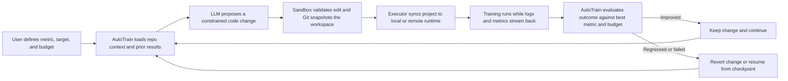
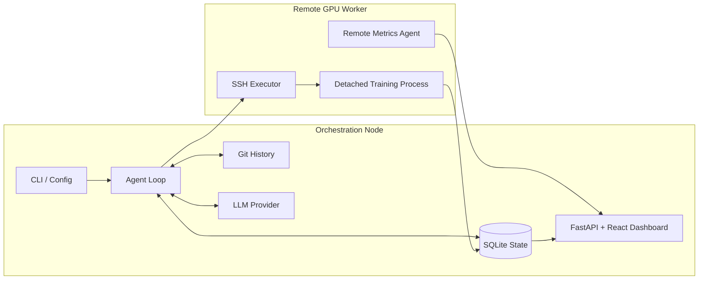

# AutoTrain

Autonomous ML training platform for LLM-guided experiment loops on local or remote GPU infrastructure.

> Academic project note: AutoTrain is an independent research and engineering project that explores whether an LLM can operate as a persistent experiment driver for machine learning workflows. It is intended as a reproducible technical prototype and demo system, not a production ML orchestration platform.

## Why AutoTrain

Training workflows are often iterative, fragile, and expensive in researcher attention. AutoTrain turns that manual loop into an agentic system:

- it reads a training repo and detects the ML framework in use
- it asks an LLM to propose constrained code changes
- it validates those changes against a sandbox
- it executes training locally or over SSH on a remote GPU machine
- it tracks results with Git and SQLite
- it keeps improvements, reverts regressions, and can resume from checkpoints

## Project Snapshot

- 56 Python modules and 20 TypeScript/TSX frontend files
- 6,529 lines of Python and 1,363 lines of frontend code
- 125 passing tests
- FastAPI + React dashboard with WebSocket updates
- Remote GPU execution with SSH, `rsync`, detached processes, and live metrics
- Multi-provider LLM support across Anthropic, DeepSeek, and Ollama

## Core Capabilities

- Framework-aware optimization for Ultralytics, Hugging Face, Keras, Lightning, XGBoost, scikit-learn, and generic PyTorch-style scripts
- Safe file editing through whitelists, diff validation, and startup checks
- Experiment history tracked through Git commits and automatic rollbacks
- Budget enforcement for time, iterations, and estimated API cost
- Structured metric extraction, per-epoch curve capture, and crash feedback into the next iteration
- Real-time dashboarding for metrics, curves, iteration history, reasoning logs, and GPU resources

## How It Works



## System Architecture



## Quick Start

```bash
git clone https://github.com/h01t/autorun.git
cd autorun
uv sync
```

Minimal `autotrain.yaml`:

```yaml
agent:
  provider: deepseek
  model: deepseek-v4-pro

metric:
  name: val_auc
  target: 0.85
  direction: maximize

budget:
  time_seconds: 4h
  max_iterations: 20

execution:
  mode: ssh
  train_command: ".venv/bin/python train.py"
  ssh_host: my-gpu-box
  ssh_remote_dir: /home/user/project
  gpu_device: "0"

sandbox:
  writable_files:
    - train.py
```

Run the loop:

```bash
autotrain run --repo /path/to/your-model -v
```

Launch the dashboard:

```bash
autotrain dashboard --repo /path/to/your-model
```

## Demo Workflow

AutoTrain is designed around a practical research loop:

1. Start from a baseline training script and choose a metric target.
2. Point AutoTrain at the repo and define a budget.
3. Let the agent propose small, auditable edits inside a file whitelist.
4. Run training on a local environment or a remote CUDA machine over SSH.
5. Inspect metric curves, GPU usage, iteration history, and reasoning in the dashboard.

The repository includes a YOLO-oriented example config at [examples/yolo_vehicle/autotrain.yaml](examples/yolo_vehicle/autotrain.yaml).

## Dashboard

The web dashboard combines FastAPI, WebSockets, and a React frontend to show:

- run status and budget progress
- metric history and per-epoch training curves
- GPU utilization, memory, and temperature
- iteration comparison views
- agent reasoning and change summaries
- multi-run navigation from a single UI

Remote GPU metrics can be pushed by a lightweight agent on the worker node for near-real-time updates.

## Limitations

- AutoTrain optimizes within explicit writable-file boundaries and does not attempt broad architecture rewrites.
- Final performance still depends on the training code quality, metric quality, and available compute.
- Not every framework emits rich structured logs, so metric extraction quality varies by training script.
- This is a research prototype, so operational concerns such as multi-user scheduling, auth, and fleet management are intentionally out of scope.

## Documentation

- Canonical project overview: [docs/project-overview.md](docs/project-overview.md)
- Example SSH/GPU config: [examples/yolo_vehicle/autotrain.yaml](examples/yolo_vehicle/autotrain.yaml)

To export the overview to PDF locally (with a TeX engine such as `pdflatex` installed):

```bash
pandoc docs/project-overview.md -o /tmp/project-overview.pdf
```

## License

Released under the MIT License. See [LICENSE](LICENSE).
