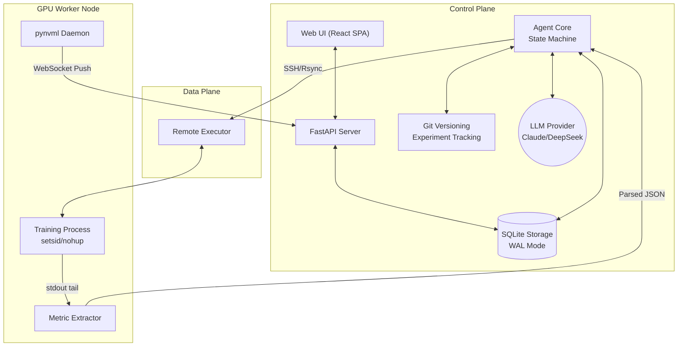
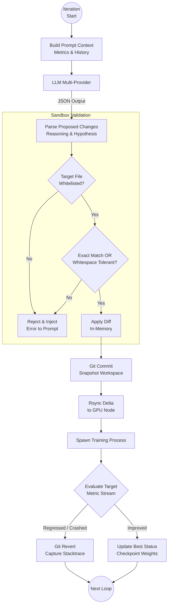
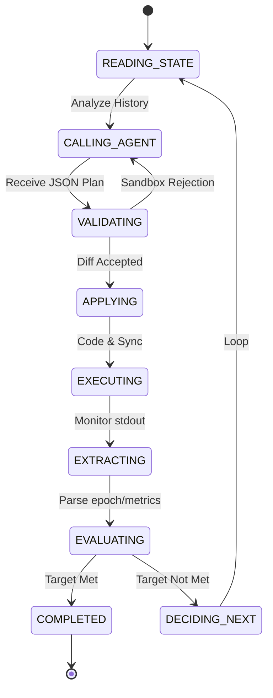

# AutoTrain: Autonomous Machine Learning Training Platform

## Abstract

Traditional machine learning optimization is a highly manual, iterative process. Researchers construct hyperparameters, execute training, evaluate metrics, and repeat the cycle. This human-in-the-loop paradigm introduces significant latency and cognitive overhead. **AutoTrain** is an autonomous platform that replaces this cycle with an intelligent agentic loop. By injecting a Large Language Model (LLM) into the execution lifecycle, AutoTrain proposes code modifications, dispatches remote GPU jobs, evaluates the real-time metric streams, and automates self-correction based on empirical outcomes—effectively operating as a continuously active, autonomous AI researcher.

## High-Level Architecture

AutoTrain is built upon a resilient, distributed architecture designed to separate the decision-making logic from the high-throughput computational workloads.

The **Control Plane** (Local/Orchestration Node) manages the State Machine, database transactions, and LLM communication. Structured SQLite (WAL mode) enables atomic recording of per-epoch metrics concurrently retrieved from the **Data Plane** (GPU Worker). An event-driven React dashboard subscribes to real-time WebSocket feeds emitted by a lightweight, standalone `pynvml` daemon running alongside the training process.

## Application Infrastructure & Tool Execution Workflow

Safety and determinism are paramount when granting an LLM the capability to modify and execute arbitrary Python scripts. AutoTrain enforces an rigorous tool execution and validation pipeline.

### Sandbox Restrictions
Modifications are strictly limited to files specified in the `writable_files` array. Before any LLM-proposed diff is committed, the orchestration layer performs exact-match (with whitespace-tolerant fallbacks) string replacement validation. If the LLM hallucinates non-existent code segments, the pipeline short-circuits, explicitly rejecting the diff, and the error traceback is autonomously fed back to the LLM on the next iteration for immediate self-correction.

## General Agentic Workflow

The autonomous execution loop operates as a sophisticated state machine that closely mirrors the scientific method.

At its core, the agent leverages framework-specific strategies (e.g., dynamically loading XGBoost configurations vs. PyTorch Lightning playbooks). Upon execution, the framework intelligently tails standard output streams. By parsing generic scalar metrics directly from `stdout`, the system extracts dynamic gradients of evaluation metrics per epoch, enriching the context window for subsequent LLM synthesis.

## Advanced Engineering Features ("Bells and Whistles")

The platform integrates several resilient software engineering paradigms to ensure robust 24/7 operation over long training durations.

### 1. Incremental Git-Based Rollbacks
Instead of relying on ephemeral in-memory state tracking, AutoTrain treats the filesystem as the definitive source of truth. Every proposed iteration generates a discrete Git commit. If the empirical evaluation identifies a metric regression against the historical best, the entire workspace is automatically reverted via `git revert`. This ensures the execution environment is fundamentally stateless between iterations, yielding a comprehensive `git reflog` that serves as an immutable experiment history journal.

### 2. Checkpoint Recovery and Process Isolation
GPU environments are inherently volatile. To combat network partitions and transient hardware failures, computational processes are spawned using `setsid` and `nohup`. If the SSH session drops, the orchestration node can blindly cleanly reconnect and resume log tailing. Furthermore, the orchestrator actively scans output payloads for framework-standard checkpoint artifacts (`*.pt`, `weights.h5`). In the event of a crash (e.g., Out Of Memory errors), the execution state machine recovers the previous weights, injects an `AUTOTRAIN_RESUME_FROM` environment variable, and resumes autonomously instead of triggering a full epoch reset.

### 3. Asynchronous Real-Time Observability
The web dashboard operates via a dual-process architecture. A FastAPI web server handles conventional REST queries traversing the database, while a zero-dependency secondary agent is deployed to the remote GPU. This agent bridges raw `pynvml` metrics (Voltage, GPU utilization, Temperature, VRAM consumption) via sub-second WebSocket pushes back to the frontend. The React SPA employs downsampling algorithms bounded to 300 points dynamically, preserving client-side performance during multi-hour execution windows.
