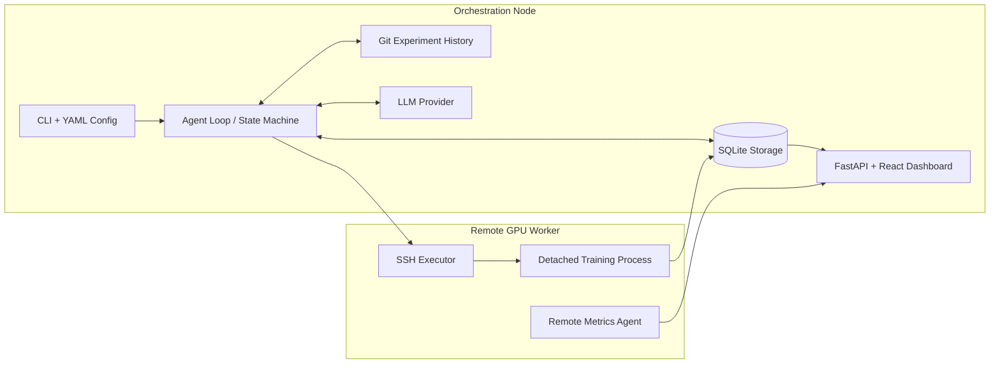
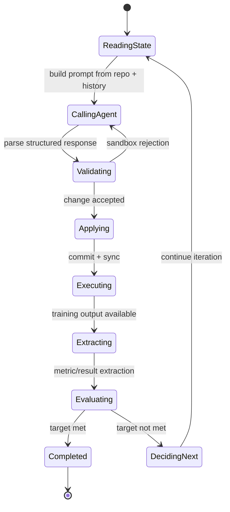
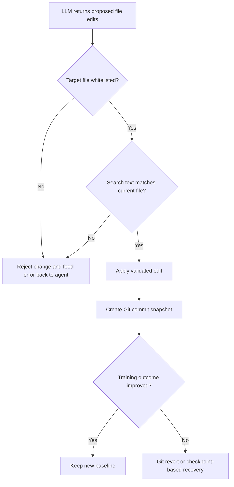
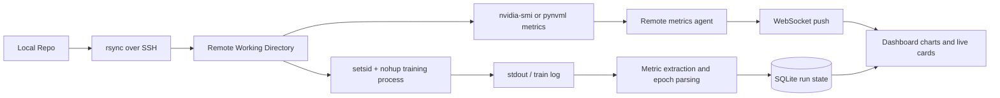

# AutoTrain

## Autonomous ML Training Platform

**Ognjen Jovanovic**  
Independent Project  
2026

---

> Academic project note: AutoTrain is an independent engineering and research project focused on autonomous ML experimentation. It is presented as a technical prototype and systems project rather than a production-ready training platform.

## Abstract

Machine learning experimentation is usually a repetitive human loop: inspect the code, change hyperparameters, run training, wait for metrics, compare outcomes, and repeat. That loop is expensive in attention even when the code changes are small. AutoTrain explores whether a large language model can act as a persistent experiment operator that stays inside explicit safety constraints while driving that iteration cycle forward.

AutoTrain combines an LLM-driven decision loop with constrained code editing, Git-based experiment history, local or SSH-based execution, and a real-time monitoring interface. The system proposes small changes, validates them against a sandbox, dispatches training to local or remote compute, extracts metrics from logs, and uses those outcomes to decide whether to continue, revert, or recover from a crash.

The result is a research-oriented orchestration system for long-running optimization loops: one that treats training as a measurable, stateful process rather than a collection of ad hoc shell commands and notebooks.

## 1. Motivation

The project is motivated by three practical problems in real ML workflows:

1. The experimentation loop is slow because decision-making and execution are tightly coupled to human availability.
2. Remote GPU workflows are brittle, especially when they depend on long-lived SSH sessions and manually tracked logs.
3. Experiment history is often fragmented across shell history, transient artifacts, and loosely documented code edits.

AutoTrain addresses these issues by treating experimentation as an explicit control problem:

- the LLM generates bounded hypotheses rather than open-ended code rewrites
- Git becomes the source of truth for workspace state and rollback
- SQLite stores run, iteration, metric, epoch, and GPU state
- the dashboard turns long-running training into an observable system

## 2. System Overview



The architecture separates orchestration from execution. The local control plane owns the state machine, prompt construction, database, Git history, and dashboard server. The remote worker is optional, but when enabled it becomes a compute mirror of the training repository and runs detached training jobs via SSH.

This split makes the platform useful in a realistic setting:

- decision-making remains on the orchestration node
- heavy training runs happen on the GPU worker
- experiment state stays queryable even after disconnects
- the UI can visualize both result history and infrastructure behavior

## 3. Agent and Training Lifecycle



Each iteration follows a scientific pattern:

1. Read the current workspace and recent experiment history.
2. Ask the model for a bounded hypothesis and a concrete code edit.
3. Validate that edit against file whitelists and search/replace rules.
4. Snapshot the change in Git and sync the repo to the execution environment.
5. Run training and capture logs, epoch signals, and final metrics.
6. Compare the outcome to the current best result and continue or revert.

This lifecycle is intentionally conservative. The system prefers auditable, incremental edits over unconstrained regeneration of the training project.

## 4. Safety, Validation, and Reproducibility



Safety is not an afterthought in AutoTrain; it is part of the design surface. The platform limits changes to explicit `writable_files`, validates search/replace edits against the current file contents, and fails fast when the training command or writable file list is clearly invalid.

Git is used as a reproducibility primitive, not just source control. Every accepted iteration becomes a commit. If the change regresses the tracked metric, AutoTrain can revert to the prior working state. This approach creates a durable experiment trail that is easy to inspect and reason about.

## 5. Remote Execution and Observability



Remote execution is designed around resilience rather than perfect interactivity. Training runs in detached process groups so that a dropped SSH session does not terminate a long experiment. Log tailing, GPU metrics, and state updates continue to feed the orchestration layer.

The observability stack has two modes:

- a fallback watchdog that samples GPU state on a fixed interval
- a lightweight remote agent that pushes metrics over WebSockets for faster updates

This gives the project an important systems property: training is treated as an observable service, not just a blocking shell command.

## 6. Engineering Highlights

### 6.1 Framework-aware behavior

AutoTrain detects the training framework from imports in writable files and adapts its prompt context accordingly. That allows the agent to reason differently about YOLO, Hugging Face, Keras, Lightning, XGBoost, or a generic training script.

### 6.2 Structured metric extraction

The platform does not depend on one framework-specific logging format. It supports JSON-first extraction, regex fallback, and common key/value output parsing. Per-epoch metrics are stored when possible, which gives the agent richer context than a single end-of-run scalar.

### 6.3 Budget control

A run can be capped by wall-clock time, iteration count, and API spend. The budget is checked both between iterations and during training so that a single runaway job cannot silently exceed the intended envelope.

### 6.4 Checkpoint-aware recovery

When training crashes but produces a usable checkpoint, AutoTrain can surface that artifact, inject a resume path into the next run, and continue from the saved state instead of restarting from scratch.

## 7. Current Limitations

- The platform is strongest when the underlying project already has a clear training entrypoint and meaningful metric output.
- The sandbox is intentionally conservative, so large multi-file redesigns are out of scope for a normal iteration.
- Remote execution assumes SSH access and a compatible runtime on the worker node.
- The system optimizes workflows around individual researchers or small teams, not multi-tenant production environments.
- PDF export is source-first: the canonical artifact is Markdown, with export handled locally rather than committed as a tracked binary.

## 8. Future Work

- Parallel experiment branches across multiple GPUs or workers
- Richer multi-file edit strategies with tighter safety checks
- Smarter early stopping and plateau detection from live epoch trends
- Better artifact retrieval for remote-only checkpoints and model exports
- More formal evaluation of agent quality across diverse ML repositories

---

## Appendix A. Project Snapshot

| Item | Value |
|---|---|
| Python modules | 56 |
| Frontend source files | 20 |
| Python LOC | 6,529 |
| Frontend LOC | 1,363 |
| Automated tests | 125 passing |
| Primary UI stack | FastAPI + React + React Query + Recharts |
| State store | SQLite (WAL mode) |
| Execution modes | Local and SSH |
| Supported providers | Anthropic, DeepSeek, Ollama |

## Appendix B. Example Configuration

```yaml
agent:
  provider: deepseek
  model: deepseek-v4-pro

metric:
  name: mAP
  target: 0.90
  direction: maximize

budget:
  time_seconds: 4h
  max_iterations: 50
  api_dollars: 2.00
  experiment_timeout_seconds: 15m

execution:
  mode: ssh
  train_command: ".venv/bin/python train.py"
  ssh_host: blackbox
  ssh_remote_dir: /home/holt/dev/object-det
  ssh_setup_command: "~/.local/bin/uv sync"
  gpu_device: "0"

sandbox:
  writable_files:
    - train.py
```

## Appendix C. CLI Summary

| Command | Purpose |
|---|---|
| `autotrain run --repo .` | Start an autonomous training run |
| `autotrain dashboard --repo .` | Launch the web dashboard |
| `autotrain status --repo .` | Inspect the latest run status |
| `autotrain history --repo .` | Review recent iterations |
| `autotrain stop --repo .` | Stop an active run |
| `autotrain monitor --repo .` | Use the legacy Streamlit monitor |

## Appendix D. Subsystem Map

| Subsystem | Responsibility |
|---|---|
| `agent/` | LLM client, prompt building, parsing, framework strategy |
| `config/` | Schema, defaults, config loading |
| `core/` | State machine, agent loop, budgets, startup checks |
| `execution/` | Local and SSH execution, sync, process handling |
| `experiment/` | Metrics, parser, Git operations, sandbox validation |
| `dashboard/` | API, WebSockets, React SPA, agent relay |
| `remote_agent/` | Lightweight GPU/log metrics forwarder |
| `storage/` | SQLite models, queries, migrations |
| `watchdog/` | Health checks and fallback GPU monitoring |

## Appendix E. Storage Schema

| Table | Purpose |
|---|---|
| `runs` | Top-level run metadata, target, status, best metric |
| `iterations` | Per-iteration outcomes, reasoning, diffs, timing, cost |
| `metric_snapshots` | Metric history across iterations |
| `epoch_metrics` | Per-epoch curves and parsed metric payloads |
| `gpu_snapshots` | GPU utilization, memory, and temperature history |

## Appendix F. Supported Providers and Frameworks

### LLM Providers

| Provider | Models |
|---|---|
| DeepSeek | `deepseek-v4-pro`, `deepseek-v4-flash` |
| Anthropic | Claude model family |
| Ollama | Local model endpoints |

### ML Framework Detection

| Framework | Detection Pattern |
|---|---|
| Ultralytics | `from ultralytics` |
| Hugging Face Transformers | `from transformers` |
| Keras / TensorFlow | `from keras` or `import tensorflow` |
| PyTorch Lightning | `import lightning` |
| scikit-learn | `from sklearn` |
| XGBoost | `import xgboost` |
| Generic | fallback |

## Appendix G. Suggested Repository Description

AutoTrain is an autonomous ML training platform that uses an LLM agent to iteratively modify training code, run remote GPU experiments, and optimize toward a target metric under explicit budget and safety constraints.

## Appendix H. Pandoc Export

Local PDF dry-run (requires a TeX engine such as `pdflatex`):

```bash
pandoc docs/project-overview.md -o /tmp/project-overview.pdf
```

The canonical tracked artifact is the Markdown source file. The generated PDF is intentionally left out of version control.
